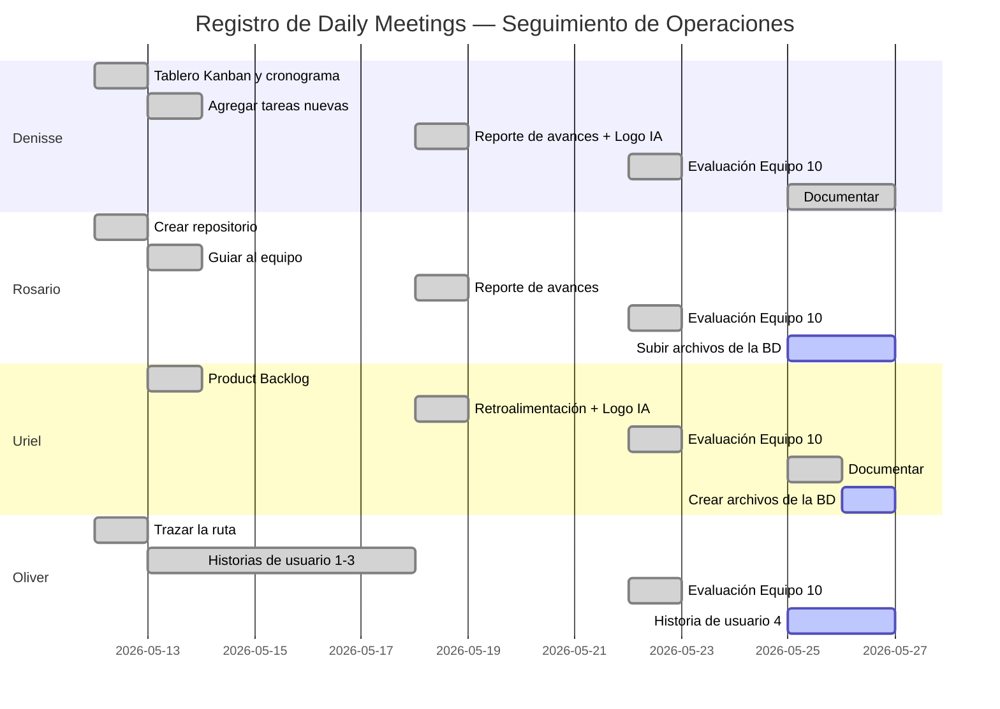

```mermaid
gantt
    title Registro de Daily Meetings — Seguimiento de Operaciones
    dateFormat  YYYY-MM-DD
    section Denisse
        Tablero Kanban y cronograma     :done,    d1, 2026-05-12, 1d
        Agregar tareas nuevas           :done,    d2, 2026-05-13, 1d
        Reporte de avances + Logo IA    :done,    d3, 2026-05-18, 1d
        Evaluación Equipo 10            :done,    d4, 2026-05-22, 1d
        Documentar                      :done,    d5, 2026-05-25, 2d

    section Rosario
        Crear repositorio               :done,    r1, 2026-05-12, 1d
        Guiar al equipo                 :done,    r2, 2026-05-13, 1d
        Reporte de avances              :done,    r3, 2026-05-18, 1d
        Evaluación Equipo 10            :done,    r4, 2026-05-22, 1d
        Subir archivos de la BD         :active,  r5, 2026-05-25, 2d

    section Uriel
        Product Backlog                 :done,    u1, 2026-05-13, 1d
        Retroalimentación + Logo IA     :done,    u2, 2026-05-18, 1d
        Evaluación Equipo 10            :done,    u3, 2026-05-22, 1d
        Documentar                      :done,    u4, 2026-05-25, 1d
        Crear archivos de la BD         :active,  u5, 2026-05-26, 1d

    section Oliver
        Trazar la ruta                  :done,    o1, 2026-05-12, 1d
        Historias de usuario 1-3        :done,    o2, 2026-05-13, 5d
        Evaluación Equipo 10            :done,    o3, 2026-05-22, 1d
        Historia de usuario 4           :active,  o4, 2026-05-25, 2d
```
